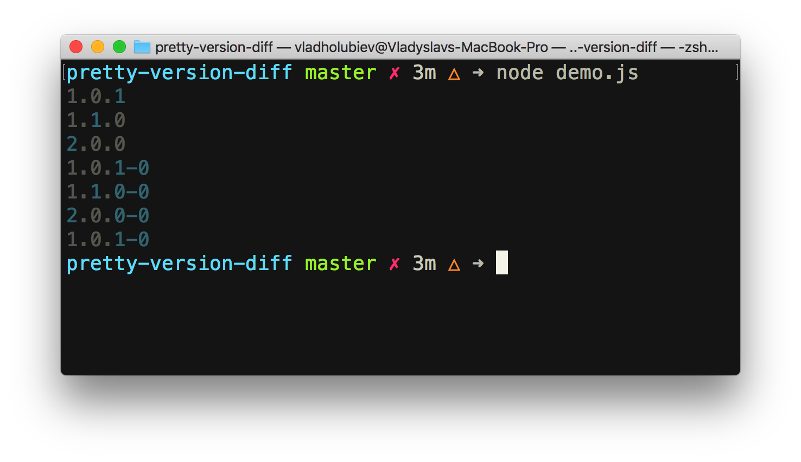

# pretty-version-diff [](https://circleci.com/gh/vladgolubev/pretty-version-diff) 

> Print semver version diff like sindresorhus/np CLI

Credits to: [sindresorhus/np](https://github.com/sindresorhus/np/blob/master/lib/ui.js#L9)

## Install

```
$ yarn add pretty-version-diff
```

## Usage

```js
const prettyVersionDiff = require('pretty-version-diff');

prettyVersionDiff('1.0.0', 'patch'); // see screenshot below
```



## License

MIT © [Vlad Holubiev](https://vladholubiev.com)
